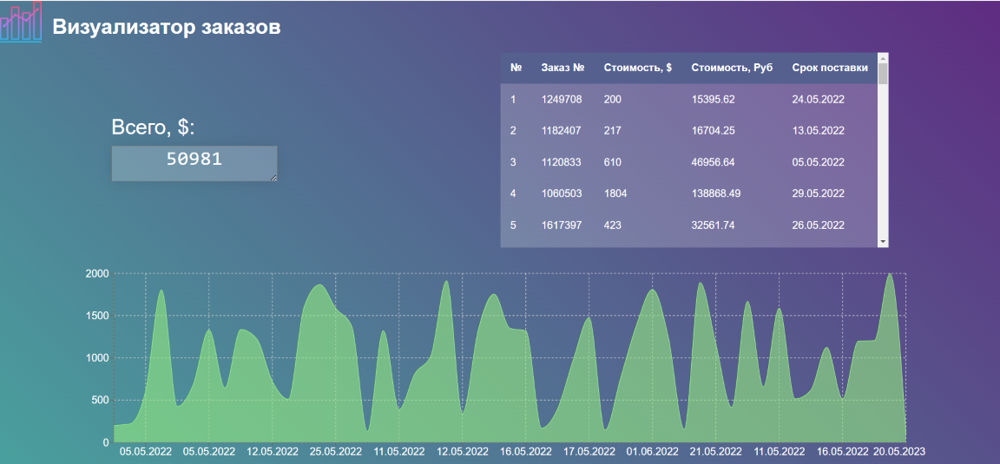

# ORDER_CONTROLLER



## **Проект отслеживания актуальной информаци о заказах.**

#### Важная информация:

[Ссылка на Google таблицу](https://docs.google.com/spreadsheets/d/1v25y2QlP14av9hejgMtp3tH_YpeugR-JeWvnvngVJos/edit?usp=sharinghttps://docs.google.com/spreadsheets/d/1v25y2QlP14av9hejgMtp3tH_YpeugR-JeWvnvngVJos/edit?usp=sharing)

#### Структура проекта:

* Backend (Flask)
  * Одностраничное веб приложение
  * Уведомления в Telegram Bot
  * Получение данных по API Google
  * Получение актуального курса по API ЦБ РФ
  * Хранение данных в бд Postgress (ORM SqlAlchemy)
  * Актуализация данных по планировщику задач (APScheduler)
* Frontend (React)
  * Таблица всех заказов
  * График цены/даты
  * Общая сумма заказов

## Как запустить проект в Docker

#### Клонировать репозиторий и перейти в него в командной строке:

```
git clone https://github.com/Bigbrotherx/Order_controller
```

```
cd Order_controller
```

#### Выполнить команду:

```
docker-compose up --build
```

#### Страница проекта:

[Order_controller](http://localhost:3000/)

## Как запустить проект самостоятельно:

#### Клонировать репозиторий и перейти в него в командной строке:

```
git clone https://github.com/Bigbrotherx/Order_controller
```

```
cd Order_controller
```

#### Cоздать и активировать виртуальное окружение:

```
python3.9 -m venv env
```

* Если у вас Linux/macOS

  ```
  source env/bin/activate
  ```
* Если у вас windows

  ```
  source env/scripts/activate
  ```

```
python3.9 -m pip install --upgrade pip
```

#### Установить зависимости из файла requirements.txt:

```
pip install -r requirements.txt
```

#### Для тестирования проект содержит файлы с ключами (никогда так не делайте с персональными данными) в случае отсутствия сделать следущее:

* [Получить](https://support.google.com/a/answer/7378726?hl=ru) .json файл от сервисного аккаунта Google
* Создать свой файл `.env`  в дериктории `<project_dir>/order_controll_app/backend`
* Содержание файла `.env` :
* ```
  SECRET_KEY=<Секретный ключ Flask приложения (любая строка известаная только вам))>
  GOOGLE_API_KEY=<Токен от сервисного аккаунта Google Cloud>
  GOOGLE_CLOUD_CREDENTIALS=<путь до json файла с секретами от сервисного аккауунта Google Cloud>
  DATABASE_PASSWORD=<Пароль вашей БД>
  DATABASE_USER=<Имя пользователя вашей БД>
  FILE_ID=<Id файла в Google Sheets>
  TELEGRAM_TOKEN = <Токен телеграм бота>
  TELEGRAM_CHAT_ID = <id чата телеграм бота>
  ```

#### Запустить вашу БД Postgress

##### Запуск в Docker:

* В корне проекта создать файл `docker-compose.yml`
* В файл поместить код:
* ```
  version: "3.9"
  networks:
   test:
  services:
    postgres:
      networks:
        - test
      image: postgres:15-alpine3.17
      environment:
        POSTGRES_DB: "db_date"
        POSTGRES_USER: "admin"
        POSTGRES_PASSWORD: "admin"
      ports:
        - "5432:5432"
  ```
* Выполнить команду в терминале `docker-compose up --build`

#### Запустить Backend приложение

```
(venv)$ python order_controll_app/main.py
```

#### Открыть второй терминал

#### Перейти в папку frontend

```
cd order_controll_app/frontend
```

#### Установить зависимости для React приложения

```
npm i
```

#### Запустить реакт приложение

```
npm start
```

#### Перейти на страницу в браузере

[Order_Controller](http://localhost:3000/)

### Эндпойнт для получения всех заказов

#### Запрос:

``http://localhost:5000/order-info``

#### Ответ:

```
[{'id': 1, 'order_name': 1249708, 'price_usd': 200, 'price_rub': 15395.62, 'expires_in': '24.05.2022'}, {'id': 2, 'order_name': 1182407, 'price_usd': 217, 'price_rub': 16704.25, 'expires_in': '13.05.2022'}, {'id': 3, 'order_name': 1120833, 'price_usd': 610, 'price_rub': 46956.64, 'expires_in': '05.05.2022'}, {'id': 4, 'order_name': 1060503, 'price_usd': 1804, 'price_rub': 138868.49, 'expires_in': '29.05.2022'}, {'id': 5, 'order_name': 1617397, 'price_usd': 423, 'price_rub': 32561.74, 'expires_in': '26.05.2022'}, {'id': 6, 'order_name': 1135907, 'price_usd': 682, 'price_rub': 52499.06, 'expires_in': '02.05.2022'}, {'id': 7, 'order_name': 1235370, 'price_usd': 1330, 'price_rub': 102380.87, 'expires_in': '05.05.2022'}, {'id': 8, 'order_name': 1329994, 'price_usd': 646, 'price_rub': 49727.85, 'expires_in': '12.05.2022'}, {'id': 9, 'order_name': 1876515, 'price_usd': 1335, 'price_rub': 102765.76, 'expires_in': '15.05.2022'}, {'id': 10, 'order_name': 1835607, 'price_usd': 1227, 'price_rub': 94452.13, 'expires_in': '05.05.2022'}, {'id': 11, 'order_name': 1465034, 'price_usd': 719, 'price_rub': 55347.25, 'expires_in': '12.05.2022'}, {'id': 12, 'order_name': 1077923, 'price_usd': 508, 'price_rub': 39104.87, 'expires_in': '01.06.2022'}]
```

## Автор

[Andrey Shchiptsov](https://github.com/Bigbrotherx)
